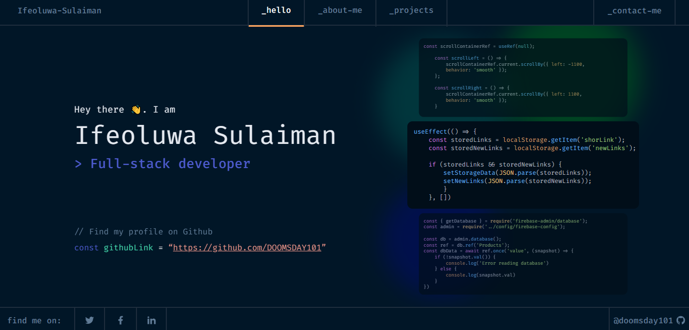

# Personal Portfolio Website

## Description

This is my personal portfolio website built using React.js. It showcases my skills, projects, and experience as a web developer. The website incorporates animations powered by Framer Motion and gsap to provide an engaging user experience.

## Features

- **Modern Design:** Sleek and intuitive user interface designed to highlight my projects and skills effectively.
- **Responsive:** Fully responsive layout ensures optimal viewing experience across all devices.
- **Animations:** Dynamic animations powered by Framer Motion and gsap add flair and interactivity to the website.
- **Project Showcase:** Dedicated section to showcase my projects with descriptions, images, and links to live demos or GitHub repositories.
- **Skills Section:** Highlighting my technical skills and proficiencies to potential employers or collaborators.
- **Contact Form:** Easy-to-use contact form for visitors to get in touch with me for collaborations, job opportunities, or inquiries.

## Live Site

[View Live Site](https://dev-ife.netlify.app/)

## Credits

- Design inspiration and layout: [Figma design by darelova](https://www.figma.com/@darelova)

## Getting Started

To run this project locally, follow these steps:

1. Clone the repository: `git clone https://github.com/DOOMSDAY101/personal-portolio-2.0`
2. Navigate to the project directory: `cd portfolio_website_2.0`
3. Install dependencies: `npm install`
4. Start the development server: `npm start`

## Contact

If you have any feedback or suggestions for improvement, please feel free to open an issue or submit a pull request. Your feedback is highly appreciated!

Feel free to reach out to me for collaborations, job opportunities, or inquiries:

- **Email:** [ifeoluwasulaiman30@gmail.com](mailto:ifeoluwasulaiman30@gmail.com)
